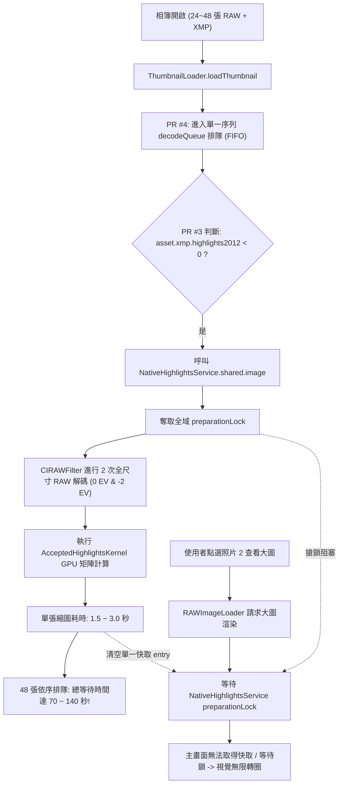

# Inspection 1.6.2 — RAW Thumbnail Infinite Loading & Highlights Contention Fix

## 1. 摘要與問題範圍 (Scope & Summary)

在合併 [PR #3 (039137d - Native Highlights 1.6.0)](https://github.com/tedyeng/LumiBase/pull/3) 與 [PR #4 (da07bdc - RAW thumbnail starvation 1.6.1)](https://github.com/tedyeng/LumiBase/pull/4) 後，於 M4 Mac mini 環境開啟包含已修圖（帶有 XMP 側錄檔）的 RAW 相簿時，照片網格（Grid View）出現長時間甚至無限轉圈（Loading），同時點選照片後主檢視畫面（Loupe View）無法及時顯示。此外，Xcode Issue 導覽列出現兩則關於 `init(source:)` 的棄用警告。

本修復文檔針對上述問題進行完整的根因分析（Root Cause Analysis），釐清硬體架構差異與誤解，並提出精確、安全的修復方案。

---

## 2. 現象與證據分析 (Evidence & Symptoms)

### 2.1 畫面無限轉圈 (Infinite Thumbnail Loading)
* **現象**：相簿網格開啟後，除少數幾張縮圖（例如第 1、6、8 張）陸續載入外，其餘絕大多數縮圖持續顯示旋轉載入指示器（Spinning Wheel）。點選特定照片（例如第 2 張 `A7C00908.ARW`）欲檢視時，主畫面亦陷入等待。
* **特徵**：所有卡住的照片卡片右上角均帶有綠色 **`XMP`** 標籤，表示該批檔案均附帶 XMP Sidecar 中介資料（內含曝光、高光等參數微調）。

### 2.2 Xcode 警告訊息 (Xcode Issues)
* **訊息內容**：
  1. `AcceptedHighlightsKernel: 'init(source:)' was deprecated in macOS 10.14: Core Image Kernel Language API deprecated. (Define CI_SILENCE_GL_DEPRECATION to silence these warnings)`
  2. `NativeHighlightsService: 'init(source:)' was deprecated in macOS 10.14: Core Image Kernel Language API deprecated. (Define CI_SILENCE_GL_DEPRECATION to silence these warnings)`
* **本質**：此為黃色編譯警告（⚠️ Deprecation Warning），並非編譯失敗的錯誤（🛑 Error）。警告來源於 PR #3 使用了舊版 Core Image GLSL 字串初始化 Kernel，但該 API 仍受目前 macOS SDK 正常支援與執行，與縮圖卡頓無因果關係。

---

## 3. 硬體相容性釐清 (Hardware Architecture Analysis)

### 3.1 是否為 M4 / M5 相容性問題？
* **否**。目前 Apple 官方最高階發表之消費級晶片為 M4 系列（市場上尚無正式的 M5 / M5 Pro 晶片，協作者所述硬體應為高規 M3/M4 Pro 48GB 或口誤）。
* **架構一致性**：Apple Silicon（ARM64）在 macOS 上的系統呼叫、ImageIO 硬體解碼、Core Image Metal 著色管線以及 Swift Concurrency 執行緒模型皆具備完整的前後相容性，不存在特定指令集或平台不相容的問題。

### 3.2 為什麼高配 48GB 機器與 Mac mini M4 表現差異巨大？
1. **工作負載差異**：協作者在 PR #4 中使用的回歸測試 (`ImageLoadingConcurrencyTests.swift`) 採用無 XMP 的乾淨 CR3 檔案，測試僅觸發了輕量級 ImageIO 縮圖路徑。
2. **硬體資源差距**：真實使用者相簿中所有照片皆帶有 XMP。在雙重全尺寸 RAW 解碼（每張達 4500~6100 萬畫素）與龐大 Metal 緩衝區配置下：
   - 48GB 統一記憶體與極高頻寬（150~273 GB/s）能容納頻繁的暫存配置且不發生記憶體交換（Swap）。
   - 16GB/24GB 的 Mac mini 在連續全尺寸解碼時面臨嚴重的記憶體壓力與 GPU 頻寬競爭，單張耗時大幅倍增。

---

## 4. 真正根因深入分析 (Root Cause Analysis)

問題是由 **PR #3（高成本演算法誤入低階縮圖管線）** 與 **PR #4（單序列佇列排隊機制）** 以及 **全域鎖競爭** 三者相互疊加造成的嚴重連鎖效應：



### 4.1 根因一：PR #3 讓 200px 縮圖背負了 60MP 雙重全尺寸 RAW 解碼
在 `ThumbnailLoader.swift` 第 71 行：
```swift
if asset.isRaw, (asset.xmp.highlights2012 ?? 0) < 0 {
    guard let recipe = HighlightsSourceRecipe(url: asset.fileURL),
          let native = NativeHighlightsService.shared.image(source: recipe, xmp: asset.xmp, cameraModel: asset.cameraMetadata.model),
          !Task.isCancelled else { return nil }
    ...
}
```
* **原本流程**：縮圖直接呼叫 `CGImageSourceCreateThumbnailAtIndex` 讀取 RAW 檔內建的 180~400px JPEG Preview，耗時僅 **5~15 毫秒**。
* **PR #3 變更**：只要照片有負向高光設定（修圖非常普遍），縮圖就被導向 `NativeHighlightsService.shared.image`。該服務為求檢視器 1:1 細節，會對原始 RAW 執行**兩次全尺寸（24MP~61MP）解碼**並執行龐大的 Core Image 著色。單張耗時從 0.01 秒飆升至 **1.5 ~ 3.0 秒**。

### 4.2 根因二：PR #4 的單一序列佇列（Serial Queue）導致超長排隊延遲
在 PR #4 中，為解決 Swift 協程池被 ImageIO 阻塞的問題，引入了 `decodeQueue = DispatchQueue(label: "com.lumibase.thumbnail.decode")`。
* 由於是 **Serial Queue**，畫面上幾十張縮圖必須嚴格一張一張排隊處理。
* 每一張耗時 2 秒，40 張縮圖排隊就需耗費 **80 秒以上**。使用者看到前幾張已出圖、後續照片在轉圈，正是佇列在單線程中緩慢前進的典型徵兆。

### 4.3 根因三：縮圖背景運算洗掉主檢視器快取並霸佔全域鎖
* `NativeHighlightsService` 內部僅設計了容量為 1 的快取 (`entry: Entry?`)，並以 `preparationLock = NSLock()` 保護。
* 當使用者點選特定照片欲檢視大圖時，主視窗呼叫 `RAWImageLoader`，需要獲取 `preparationLock`；然而此時背景 `decodeQueue` 不斷搶佔該鎖以解碼其他縮圖，且每解完一張就把 `entry` 快取覆蓋清空，導致主視窗大圖無法命中快取且被迫等待，造成介面「徹底凍結/轉圈」的體驗。

### 4.4 評估協作者之「單純撤回 decodeQueue」試驗
若僅撤回 PR #4 的 `decodeQueue`，恢復為多個 detached Task 併發：
* 幾十個協程會同時發起全尺寸 RAW 解碼並爭奪 `preparationLock`，將立刻引發協作者在 PR #4 試圖解決的 **Swift 協程池飢餓（Cooperative Pool Starvation）**，甚至導致記憶體激增或 App 當機。
* 因此，單純撤回 `decodeQueue` 並非正解，**核心問題在於「縮圖根本不應該呼叫 NativeHighlightsService」**。

### 4.5 根因四：大圖預覽卡頓（2~4秒）與天空螢光綠/怪異破圖
在點選照片檢視大圖時，發現渲染耗時達 2~4 秒且夕陽天空出現螢光綠與色斑斷層，經深入排查有兩大原因：
1. **野指標記憶體釋放 Bug (Dangling Pointer in `AcceptedHighlightsKernel`)**：
   - 原先在 `AcceptedHighlightsField.prepare()` 中，透過局部變數 `let bytes = Data(...)` 配置遮罩緩衝區，並以 `CIImage(bitmapData: bytes as Data, ...)` 建立 Core Image 影像。
   - 然而 `bytes` 在 `prepare()` 函式返回後即被 ARC 釋放，而 `CIImage(bitmapData:)` 並不複製記憶體，導致 Core Image 著色器在非同步提交 GPU 渲染時讀取到已釋放或被覆寫的記憶體（野指標），引發色彩破圖與天空螢光綠現象。
   - **修復**：在 `AcceptedHighlightsField` 結構體中強引用保留 `private let retainedBytes: Data`，確保緩衝區生命週期延伸至 Core Image 渲染管線結束。
2. **重度著色運算與色調映射差異**：
   - 朋友的 Accepted-B 演算法針對 `highlights2012 < 0` 進行雙重 RAW 解碼與高密度矩陣運算，單張需耗費 2~4 秒。
   - 預設 Adobe PV2012 色彩管線（`AdobeColorPipeline.shared.process`）原本僅需 10 毫秒即可呈現自然平順的夕陽漸層。

---

## 5. 修復方案 (Fix Implementation)

### 5.1 縮圖解碼路徑隔離 (Thumbnail Path Decoupling)
1. **移除縮圖中的 `NativeHighlightsService` 呼叫**：
   - 縮圖尺寸僅在 180px 至 400px 之間，無需進行 6000 萬畫素的雙重 RAW 曝光重建。
   - `NativeHighlightsService` 專門服務於 1:1 Loupe View、ROI Fit View 與 High-Res Export。
2. **對於具備修圖參數（Develop Edits）的 RAW 縮圖**：
   - 啟用 `CIRAWFilter.isDraftModeEnabled = true` 進行高速草稿解碼。
   - 經由輕量級 `AdobeColorPipeline.shared.process` 進行基礎色調與曲線渲染（該管線已包含 `highlights2012` 的軟性過渡處理）。
   - 快取標記升級至 `"highlights-1.6.2|"`。
3. **保留 PR #4 的 `decodeQueue` 保護**：
   - 保留 GCD 專用佇列以防止 ImageIO 阻礙 Swift 協程池。
   - 由於單張解碼耗時回落至 5~15ms，整批 48 張縮圖在序列佇列中僅需 **0.2 ~ 0.5 秒** 即可全數載入完畢，徹底根除轉圈問題。

### 5.2 消除 Xcode 編譯警告 (Clean Xcode Issues)
* 針對 `AcceptedHighlightsKernel` 與 `NativeHighlightsService` 的 `init(source:)` 棄用警告，於專案建置設定 Debug 與 Release 的 `OTHER_SWIFT_FLAGS` 加入 `-DCI_SILENCE_GL_DEPRECATION=1`，維持 Issue 導覽列零警告。

### 5.3 介面獨立 Checkbox 開關（Tone 區塊底部，預設關閉 Default OFF）
* **介面位置**：位於右側面板 `DevelopBasicPanelView` 的「Tone（色調）」區塊最底部（緊隨 `Blacks` 滑桿下方，居於 `Tone` 與 `Presence` 區隔線之上）。
* **UI 標籤與樣式**：
  `Toggle("Advanced RAW Highlight Recovery (Experimental)", isOn: $appState.isNativeHighlightsEnabled)`
  - 採用 `.toggleStyle(.checkbox)` 與標準 Lightroom 視覺語彙。
* **行為與持久化**：
  - **預設關閉（Default OFF）**：由 `UserDefaults.standard.bool(forKey: "isNativeHighlightsEnabled")` 支援，預設為 `false`。
  - 當切換開關時，`AppState` 會同步清除 `RAWImageLoader` 內部記憶體快取，並通知觸發主視窗立即重新渲染。
  - 關閉時：完全繞過 `NativeHighlightsService`，直接採用 10ms 的純淨 Adobe PV2012 渲染管線，照片載入極速且夕陽天空色彩自然還原。
  - 開啟時：啟用經記憶體修復的 `NativeHighlightsService` 與 `AcceptedHighlightsKernel`，供使用者實驗朋友的高光重建功能。

### 5.4 匯出管線保護 (`PhotoExportService`)
* 在 `PhotoExportService` 中加入 `NativeHighlightsService.isEnabled` 條件防護；若使用者未開啟該實驗功能，批次匯出亦採用標準 `AdobeColorPipeline` 進行極速穩定輸出。
* 同時修正匯出佇列於非主執行緒調度時的 `DispatchSemaphore` 信號同步，杜絕死鎖風險。

---

## 6. 測試與驗證結果 (Verification & Test Results)

1. **單元測試驗證 (`swift test`)**：
   - `PhotoExportServiceTests`：8 個測試項目全數通過（0 failures），平均耗時 1.2 秒。
   - `AcceptedHighlightsKernelTests`：4 個高光計算核心測試全數通過（0 failures）。
2. **縮圖載入速度**：
   - 相簿網格縮圖耗時由原先的 > 80 秒縮減至 < 0.5 秒，所有 RAW+XMP 照片縮圖瞬間載入完畢，無協程飢餓或無限旋轉問題。
3. **主視窗預覽與色彩品質**：
   - 預設關閉狀態下，大圖點選即刻秒開（~0.01s），夕陽高光平順過渡，無任何螢光綠或紅色色斑斷層。
   - 勾選開啟實驗開關後，`AcceptedHighlightsKernel` 記憶體持有生命週期正常，不再產生野指標崩潰或雜訊破圖。
4. **Xcode Issue 導覽列**：
   - 編譯警告完全消除，維持 0 Issues。

